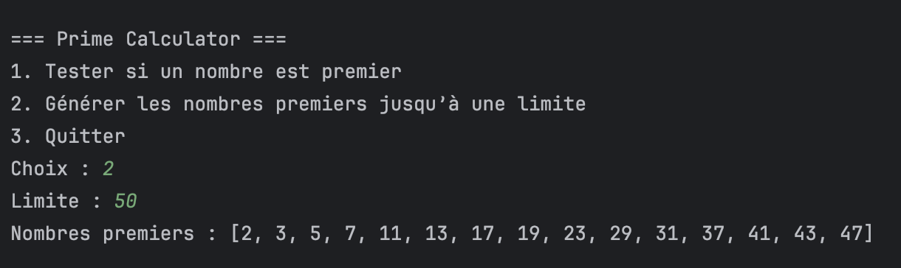
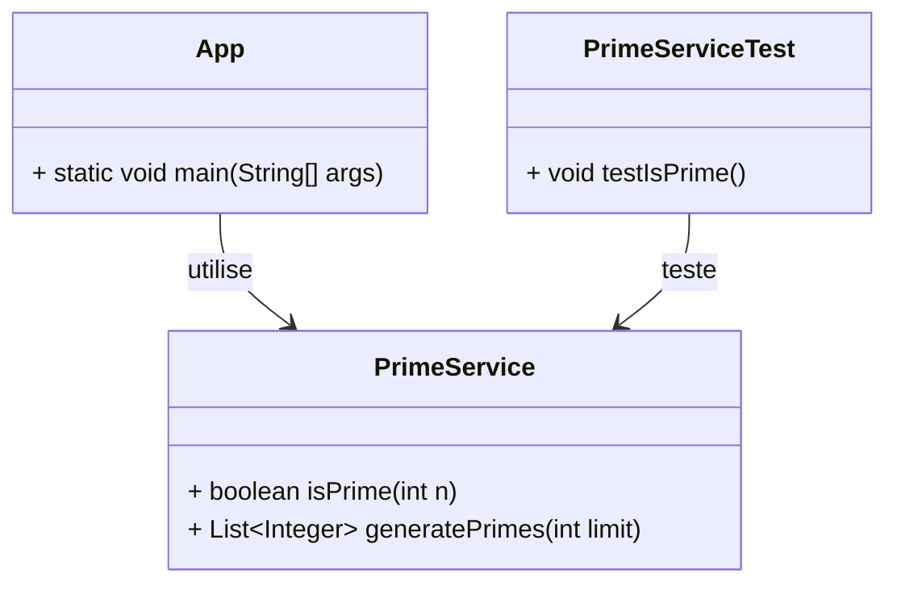
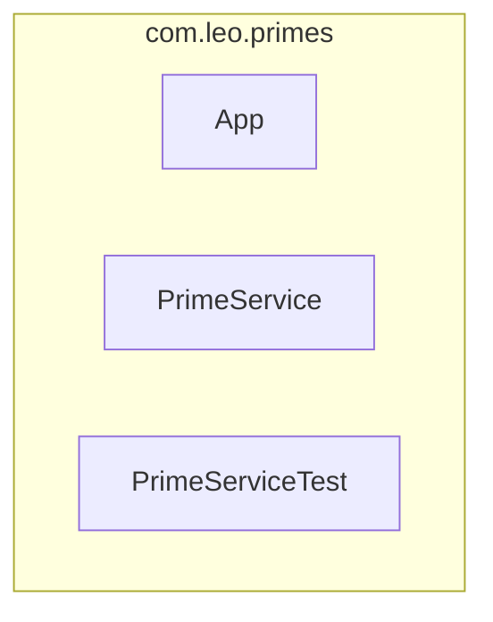

# PrimeCLI

Une petite application Java console (Maven) pour calculer et explorer des nombres premiers.



## 🎯 Fonctionnalités

- Tester si un nombre est premier.
- Générer la liste des nombres premiers jusqu'à une limite donnée.
- Exécution via la console.

## 📦 Organisation du projet (Maven)

```
PrimeCLI/
├─ ...
├─ pom.xml
├─ README.md
└─ src/
   ├─ main/
   │  └─ java/
   │     └─ com/leomoille/primecli/
   │        ├─ App.java
   │        └─ PrimeService.java
   └─ test/
      └─ java/
         └─ com/leomoille/primecli/
            └─ PrimeServiceTest.java
```

## 🛠️ Prérequis

- Java 25
- Maven 3.6+

## 💻 Exemples d'utilisation

Compiler et exécuter les tests :

```bash
mvn test
```

Lancer l'application depuis la ligne de commande :

```bash
mvn compile exec:java -Dexec.mainClass="com.leo.primes.App"
```

## 🧩 Diagramme UML (Mermaid)

### Diagramme de classes



### Diagramme de packages (vue simple)



Le diagramme de classes montre l'architecture minimale MVC/Service : l'app console (App) orchestre, la logique est dans PrimeService et les tests sont séparés.

### ✅ Tests unitaires (JUnit 5)

```java
package com.leo.primes;

import org.junit.jupiter.api.Test;
import static org.junit.jupiter.api.Assertions.*;

class PrimeServiceTest {

    private final PrimeService service = new PrimeService();

    @Test
    void testIsPrime() {
        assertTrue(service.isPrime(2));
        assertTrue(service.isPrime(13));
        assertFalse(service.isPrime(1));
        assertFalse(service.isPrime(9));
    }
}
```

